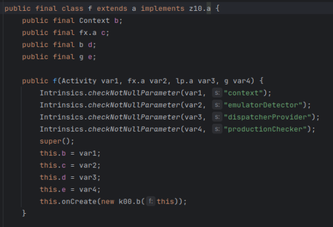
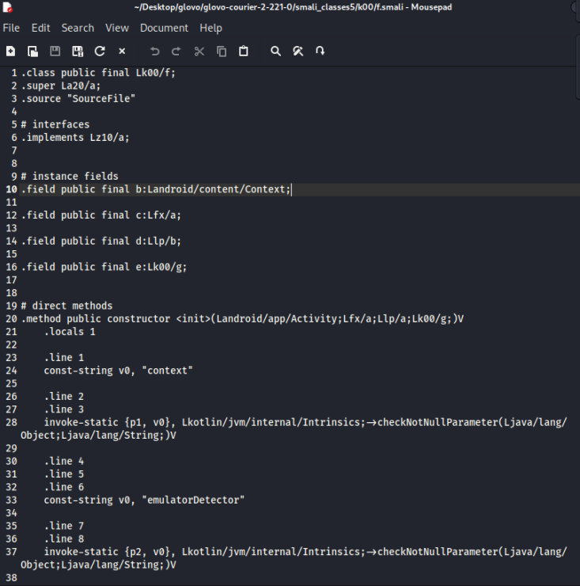
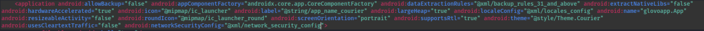
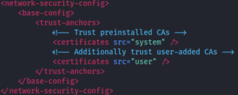
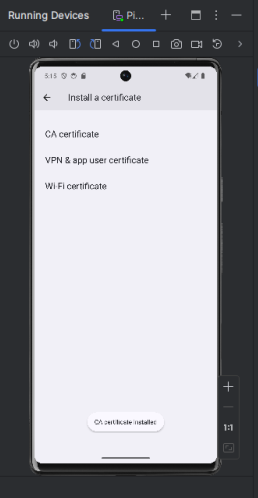
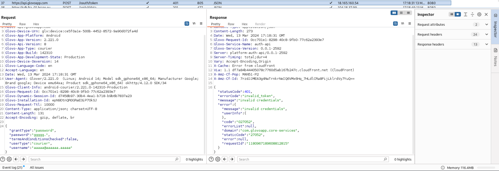

# GlovoBOT
# What was it
It was a bot to book automatically hours on your courier account on glovo. They probably changed their API. This is probably not working at this point.
It was working as of march 2023. The issue is it's pretty useless due to fact that couriers that already have their rating receive hours 30 minutes before others. 
Also of course this is against terms of service but while i was testing it i seen that hours dissapear before my bot does something (you can't do it faster in GUI) meaning that other couriers were botting too Lol.
## Updating code guide
I provide base code, they can update their API whenever. You can reverse their API again and update my code or change it for your needs

You need of course courier account, While updating this guide i did not have access to this account. So i couldn't verify if i removed emulator checking correctly. (Emulator check is after login, so you can still run app on emulator but the issue is after login)

Prepare emulator for android (I used android studio) and mitmproxy.

1. Get .apk on linux machine, install android studio, choose debug apk option, then i did clear text search
<br>
2. (Optional) If you need to look at java files <br> run ```apktool d apk.apk``` <br>
Then inside of created directory <br>
run ```d2j-dex2jar classes.dex classes2.dex classesN.dex``` it will create .jar files that you can decompile and then index in idea and perform static analysis. <br>

3. run ```apktool d apk.apk``` it will decompile each class into .smali file. I don't have current account to do it properly long story short you need to skip emulator check using this file, last time i did it i had to just jump one if statement. 

4. Edit AndroidManifest.xml <br>
You need to add ```android:networkSecurityConfig=@xml/network_security_config``` to ```<application>``` tag. <br>
 <br>
You also need to create  file under ```res/xml/network_security_config.xml``` <br>
With following contents, it will allow to use user certificate so you can decrypt traffic later.
<br>

5. Compiling everything back, Make sure that you use up to date version of apktool, zipalign, apksigner. I tried to do it on kali linux but it's outdated and result in errors.
<br> run ```apktool b folder_with_apk```
6. Then to sign APK i followed https://stackoverflow.com/questions/10930331/how-to-sign-an-already-compiled-apk <br>
```keytool -genkey -v -keystore my.keystore -keyalg RSA -keysize 2048 -validity 10000 -alias app``` <br>
```zipalign -p 4 my.apk my-aligned.apk``` <br>
```apksigner sign --ks-key-alias alias_name --ks my.keystore my-app.apk```
7. Setup proxy and install certificate on a device, I used burpsuite and android studio for emulator, You need to download certificate and install it on device <br>

8. Using android studio select option to profile or debug apk then run it on device. The result should be like that on your proxy

9. You can start doing what you want :)
### Why I post it outdated 
I want to keep it as a resource for others and the code for the bot is not even that bad i spend some time optimizing it. It was faster than other bot but  probably because other bot was running under node js or some other crap.